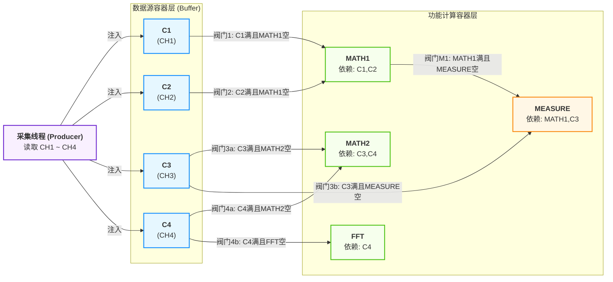

# 插件和采集线程的数据流向

## 面临的难点
1. 消费者对象很多，而且和采集线程相互耦合，消费者之间又有相互依赖，关系错综复杂
2. 消费者和采集线程的同步关系， 既有同步又有异步场景，相互交错
3. 多个消费者同时打开，线程管理困难。为了保证同步，全局互斥锁用的太多导致系统运行效率低

## 目标
1. **让消费者对象（插件功能）和采集线程解耦**
2. **确保所有消费的数据输入是同一次采集的数据**
3. **让数据流转和数据采集达到最大效率**
4. **兼容所有消费者模型**

## 数据阀门打开的条件：
1. 上游节点满了 （数据准备好了）
2. 下游节点为空闲 （可以接受新的输入数据，数据槽为空）

## 数据流向需要考虑的问题
1. 每个节点的数据传递方式是什么样的？
2. 数据持有者是谁？
3. 每个节点如何获取上下游的状态？如果上游被阻塞，如何唤醒？
4. 同步和异步节点如何管理？
5. 节点和依赖节点被析构或者依赖对象发送变化，拓扑图关系怎么维护（下一帧重建）

## 线程调度问题
1. 线程关系分配的原则是什么？（没有依赖关系的分多个线程并行处理， 有依赖的跟在其中一方依赖对象在同一个线程，保证效率最大化）
2. 线程创建有没有数量限制
3. 如何回收线程

## 问题
1. 数据同步
2. 如何定义琐的数量
3. 线程间交互
4. 线程划分（多耦合的节点怎么分配）
5. 采集线程有几个采集请求

## 结论
1. 数据复用，固定长度公用一个数据（PKG数据）。
2. 数据独占模型（校正，自动设置）
3. 保证所有和模拟通道波形的显示一定是同步的，同一帧刷出来
4. 用计数信号量，只有计数信号量为0了，采集线程才能往顶层节点推送新的数据，节点切换的时候信号量先++再--
5. 线程划分（合并预定义线程和创建新的线程）
- CH1~CH4 插值抽点， math计算
- FFT
- bode
- UPO 转RGB，拉伸处理
- 自动设置，校正

